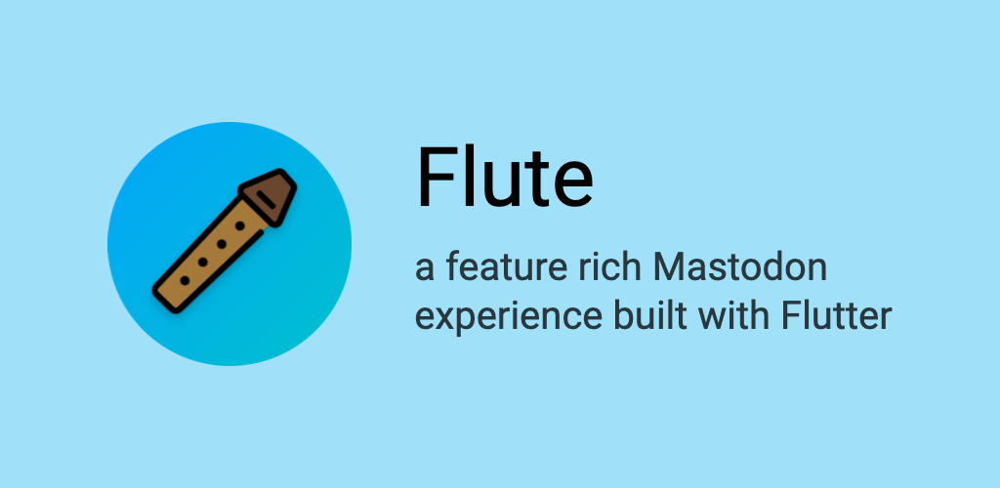

## Why create flute?
After @robertodoering announced that harpy would no longer be in active development following Twitter's decision to disallow third-party Twitter clients, I thought I would create a version of Harpy that uses Mastodon instead of Twitter.

## What's working?
* Nothing :(